<div align="center">



# OBD2 CAN Bus Library

**OBD-II diagnostics over the CAN bus for the ESP32.**<br>
An Arduino library that talks to a vehicle's ECU over ISO 15765-4 using the ESP32's built-in CAN controller — automatic protocol detection, live sensor data, trouble codes, freeze frame and vehicle information, without an ELM327.

[](https://github.com/muki01/OBD2_CAN_Bus_Library/stargazers)
[](https://github.com/muki01/OBD2_CAN_Bus_Library/forks)
[](https://github.com/muki01/OBD2_CAN_Bus_Library/issues)
[](LICENSE)
[](https://github.com/muki01/OBD2_CAN_Bus_Library/commits)
[](https://www.ardu-badge.com/OBD2%20CanBus)
[](https://registry.platformio.org/libraries/muki01/OBD2%20CanBus)


[Installation](#-installation) ·
[Quick Start](#-quick-start) ·
[Protocols](#-supported-protocols) ·
[API](#-api-reference) ·
[Wiring](#-wiring) ·
[Examples](#-examples)

</div>

---

## 🌟 Overview

Every car sold in the last two decades carries its diagnostics on the **CAN bus**. **OBD2 CanBus** puts an ESP32 on that bus: it finds the right protocol, sends standard OBD-II requests and returns the answers as ready-to-use values.

The bus runs on the ESP32's built-in **TWAI** controller, so the only extra part you need is a CAN transceiver.


## ❓ Does Your Vehicle Use CAN?

Look at the OBD-II connector under the dashboard:

- ✅ **Pins 6 and 14 populated → CAN bus.** This library will work.
- ❌ **Pin 7 populated, no pins 6 and 14 → K-Line** (ISO 9141 / KWP2000). Use the [OBD2 K-Line Library](https://github.com/muki01/OBD2_KLine_Library) instead.

<table>
  <tr>
    <td width="50%"></td>
    <td width="50%"></td>
  </tr>
  <tr>
    <td align="center"><b>CAN bus</b> — pins 6 and 14</td>
    <td align="center"><b>K-Line</b> — pin 7</td>
  </tr>
</table>

## ✨ Features

- 🔀 **Automatic protocol detection** — 11-bit and 29-bit identifiers at 250 and 500 kbit/s.
- 📊 **Live sensor data** — real-time PIDs converted to engineering units.
- ⚠️ **Trouble codes** — read stored and pending DTCs as readable codes, and clear them.
- ❄️ **Freeze frame** — the sensor snapshot stored with a fault.
- 🚙 **Vehicle information** — VIN and calibration IDs.
- 🔎 **Supported-PID scan** — ask the ECU what it implements before requesting it.
- 🐞 **Debug output** — every frame, in both directions, on any `Stream`.

## 📡 Supported Protocols

| Protocol | Identifiers | Bit rate | Request | Response |
| :-- | :-- | :-- | :-- | :-- |
| `"11b500"` | 11 bit | 500 kbit/s | `7DF` | `7E8` |
| `"29b500"` | 29 bit | 500 kbit/s | `18DB33F1` | `18DAF110`, `18DAF111` |
| `"11b250"` | 11 bit | 250 kbit/s | `7DF` | `7E8` |
| `"29b250"` | 29 bit | 250 kbit/s | `18DB33F1` | `18DAF110`, `18DAF111` |
| `"Automatic"` | detected | detected | — | — |

`"Automatic"` is the default; it tries the four combinations until one answers.

### OBD-II services

| Mode | Description |
| :-- | :-- |
| `01` | Live data — real-time sensor values |
| `02` | Freeze frame data |
| `03` | Stored Diagnostic Trouble Codes (DTCs) |
| `04` | Clear DTCs and reset the MIL |
| `05` | Oxygen sensor test results |
| `06` | On-board monitoring test results |
| `07` | Pending Diagnostic Trouble Codes |
| `09` | Vehicle information — VIN, calibration IDs |

## 📦 Installation

**Arduino IDE** — open **Sketch → Include Library → Manage Libraries…**, search for **OBD2 CanBus** and click **Install**.

**PlatformIO** — add it to `platformio.ini`:

```ini
lib_deps = muki01/OBD2 CanBus
```

**Manual** — download this repository as a ZIP and add it with **Sketch → Include Library → Add .ZIP Library…**

> The library uses the ESP32 TWAI driver and therefore runs on **ESP32 boards only**.

## 🚀 Quick Start

Read engine speed, coolant temperature and vehicle speed:

```cpp
#include "OBD2_CanBus.h"

OBD2_CanBus CanBus(12, 13);          // RX, TX

void setup() {
  Serial.begin(115200);

  CanBus.setDebug(Serial);           // Optional: view communication logs
  CanBus.setProtocol("Automatic");   // or "11b500", "29b500", "11b250", "29b250"
  CanBus.setReadTimeout(200);        // Optional: maximum time (ms) to wait for a response
}

void loop() {
  if (CanBus.initOBD2()) {
    float rpm     = CanBus.getLiveData(0x0C);  // PID 0x0C: Engine RPM
    float coolant = CanBus.getLiveData(0x05);  // PID 0x05: Coolant Temp
    float speed   = CanBus.getLiveData(0x0D);  // PID 0x0D: Vehicle Speed

    Serial.print("RPM: ");   Serial.println(rpm);
    Serial.print("Temp: ");  Serial.print(coolant); Serial.println(" C");
    Serial.print("Speed: "); Serial.print(speed);   Serial.println(" km/h");

    delay(1000);
  }
}
```

### Reading trouble codes

```cpp
uint8_t storedCount = CanBus.readStoredDTCs();   // Mode 03
for (uint8_t i = 0; i < storedCount; i++) {
  Serial.println(CanBus.getStoredDTC(i));        // e.g. P0171
}

CanBus.clearDTC();                               // Mode 04
```

## 📘 API Reference

### Connection

| Method | Description |
| :-- | :-- |
| `OBD2_CanBus(rxPin, txPin)` | Constructor; selects the TWAI RX and TX pins. |
| `setProtocol(name)` | One of the protocols in the table above. |
| `initOBD2()` | Open the bus and confirm that an ECU answers; returns `true` when the vehicle responds. |
| `setReadTimeout(ms)` | Maximum time to wait for a response. |
| `setDebug(stream)` | Print every frame to any `Stream`. |
| `initTWAI()` / `stopTWAI()` | Start or stop the TWAI driver by hand. |

### Standard OBD-II diagnostics

| Method | Description |
| :-- | :-- |
| `getLiveData(pid)` | Mode 01 value, converted to engineering units. |
| `getFreezeFrame(pid)` | Mode 02 value from the stored snapshot. |
| `getPID(mode, pid)` | The same, with the mode given explicitly. |
| `readStoredDTCs()` / `getStoredDTC(i)` | Read and retrieve stored trouble codes. |
| `readPendingDTCs()` / `getPendingDTC(i)` | Read and retrieve pending trouble codes. |
| `clearDTC()` | Clear trouble codes and reset the MIL. |
| `getVehicleInfo(pid)` | VIN (`0x02`), calibration ID (`0x04`), calibration verification number (`0x06`). |
| `readSupportedLiveData()` / `getSupportedData(mode, i)` | Scan which PIDs the ECU supports. |

### Low-level access

| Method | Description |
| :-- | :-- |
| `writeData(mode, pid)` | Build and send an OBD-II query frame. |
| `writeRawData(message)` | Put a frame on the bus exactly as given. |
| `readData()` | Read the response addressed to the tester. |

## 🔌 Wiring

The ESP32 has the CAN controller built in; a **CAN transceiver** — TJA1050, SN65HVD230 or similar — sits between it and the vehicle.


| OBD-II pin | Signal |
| :-: | :-- |
| **6** | CAN-H |
| **14** | CAN-L |
| **16** | Battery +12 V |
| **4 / 5** | Ground |

Any free GPIO pair can be used for RX and TX; pass them to the constructor.

## 🧪 Examples

| Example | What it shows |
| :-- | :-- |
| [`GetLiveData`](examples/GetLiveData) | Real-time sensor values (Mode 01) |
| [`GetFreezeFrame`](examples/GetFreezeFrame) | The snapshot stored with a fault (Mode 02) |
| [`ReadDTC`](examples/ReadDTC) | Stored and pending trouble codes (Modes 03 and 07) |
| [`ClearDTC`](examples/ClearDTC) | Clear trouble codes and reset the MIL (Mode 04) |
| [`GetVehicleInfo`](examples/GetVehicleInfo) | VIN and calibration IDs (Mode 09) |
| [`GetSupportedPIDs`](examples/GetSupportedPIDs) | Which PIDs the ECU implements |
| [`TestAll`](examples/TestAll) | All of the above in one sketch |

## 📊 Typical Data Rates

| Bit rate | Average responses per second |
| :-- | :-- |
| 500 kbit/s | More than 100 |
| 250 kbit/s | Not measured |

Actual throughput depends on the ECU's processing time and the requested PID.

## 🤝 Contributing

Contributions are welcome — bug reports, tested vehicle reports, fixes and documentation improvements. Please read the **[Contributing Guide](CONTRIBUTING.md)** and the **[Code of Conduct](CODE_OF_CONDUCT.md)**.

**Tested it on your car?** Open a [vehicle report](https://github.com/muki01/OBD2_CAN_Bus_Library/issues/new/choose) with the make, model and year. Real-world reports help everyone.

## 🔗 Related Projects

This library is part of a family of open-source automotive projects. They share the same hardware approach, so what you build for one carries over to the others.

<table>
  <tr>
    <th colspan="3" align="left">Firmware — flash it and use it</th>
  </tr>
  <tr>
    <td width="30%"><a href="https://github.com/muki01/BMW_IBus_KBus"><b>BMW I-Bus / K-Bus Firmware</b></a></td>
    <td>Phone control and key-fob light functions for the BMW E46, on the ESP32 and Arduino.</td>
    <td width="96" align="center"><a href="https://github.com/muki01/BMW_IBus_KBus/stargazers"></a></td>
  </tr>
  <tr>
    <td width="30%"><a href="https://github.com/muki01/OBD2_K-line_Reader"><b>OBD2 K-Line Reader</b></a></td>
    <td>Scan tool for K-Line cars (ISO 9141-2, KWP2000) with a web dashboard, for the ESP32, ESP8266 and Arduino.</td>
    <td width="96" align="center"><a href="https://github.com/muki01/OBD2_K-line_Reader/stargazers"></a></td>
  </tr>
  <tr>
    <td width="30%"><a href="https://github.com/muki01/OBD2_CAN_Bus_Reader"><b>OBD2 CAN Bus Reader</b></a></td>
    <td>Scan tool for CAN bus cars (ISO 15765-4) with the same web dashboard, for the ESP32.</td>
    <td width="96" align="center"><a href="https://github.com/muki01/OBD2_CAN_Bus_Reader/stargazers"></a></td>
  </tr>
  <tr>
    <td width="30%"><a href="https://github.com/muki01/VAG_KW1281"><b>VAG KW1281</b></a></td>
    <td>KW1281 diagnostics for VW, Audi, Škoda and SEAT: ECU information, measuring groups and fault codes.</td>
    <td width="96" align="center"><a href="https://github.com/muki01/VAG_KW1281/stargazers"></a></td>
  </tr>
  <tr>
    <th colspan="3" align="left">Libraries — build your own firmware</th>
  </tr>
  <tr>
    <td width="30%"><a href="https://github.com/muki01/BMW_IBus_KBus_Library"><b>BMW IBus KBus Library</b></a></td>
    <td>Receives, checks and sends BMW I-Bus and K-Bus messages; the library behind the BMW firmware.</td>
    <td width="96" align="center"><a href="https://github.com/muki01/BMW_IBus_KBus_Library/stargazers"></a></td>
  </tr>
  <tr>
    <td width="30%"><a href="https://github.com/muki01/OBD2_KLine_Library"><b>OBD2 K-Line Library</b></a></td>
    <td>K-Line diagnostics behind one API: ISO 9141-2, KWP2000, KW1281, DS2 and KW82.</td>
    <td width="96" align="center"><a href="https://github.com/muki01/OBD2_KLine_Library/stargazers"></a></td>
  </tr>
  <tr>
    <td width="30%"><b>OBD2 CAN Bus Library</b><br><sub>you are here</sub></td>
    <td>OBD-II diagnostics over ISO 15765-4 with the ESP32's built-in CAN controller.</td>
    <td width="96" align="center"><a href="https://github.com/muki01/OBD2_CAN_Bus_Library/stargazers"></a></td>
  </tr>
  <tr>
    <th colspan="3" align="left">Interface</th>
  </tr>
  <tr>
    <td width="30%"><a href="https://github.com/muki01/OBD2-Diagnostic-UI"><b>OBD2 Diagnostic UI</b></a></td>
    <td>The web dashboard used by the two OBD2 readers.</td>
    <td width="96" align="center"><a href="https://github.com/muki01/OBD2-Diagnostic-UI/stargazers"></a></td>
  </tr>
</table>

## 💼 Custom Development

I design automotive diagnostic tools, firmware and hardware professionally. Whether you need a complete product or only the communication layer, I can help.

| Service | Details |
| :-- | :-- |
| **Protocol implementation** | BMW I/K-Bus, K-Line (ISO 9141-2 / KWP2000), CAN / UDS, VAG KW1281 and other manufacturer-specific protocols |
| **ECU communication & reverse engineering** | Bus sniffing, packet decoding, module control, undocumented ECUs and buses |
| **ECU security access** | Seed-key algorithms and unlock routines for KWP2000 / UDS |
| **Embedded firmware** | Arduino, ESP32, ESP8266, STM32, Raspberry Pi Pico |
| **Custom hardware** | Diagnostic dongles, shields and PCBs designed to your requirements |
| **Companion apps** | Android, iOS and web apps to visualise, log and control your device |

Have a project in mind? Reach out through the [Contact](#-contact) section below.

## 📬 Contact

For ECU-specific code, custom development, collaboration or ready-made devices:

| Channel | Address |
| :-- | :-- |
| 📧 **Email** | [muksin.muksin04@gmail.com](mailto:muksin.muksin04@gmail.com) |
| 💼 **LinkedIn** | [linkedin.com/in/muksin-muksin](https://www.linkedin.com/in/muksin-muksin/) |
| 🐙 **GitHub** | [@muki01](https://github.com/muki01) |

## ☕ Support the Project

[](https://www.buymeacoffee.com/muki01)
[](https://www.paypal.com/donate/?hosted_button_id=SAAH5GHAH6T72)
[](https://github.com/sponsors/muki01)

## ⚠️ Disclaimer

> [!WARNING]
> Connecting custom hardware to a vehicle carries risk. Use the library at your own risk; the author accepts no responsibility for damage or malfunction.

## 📄 License

Released under the **[GNU General Public License v3.0](LICENSE)**.

- You are free to use, study, modify and share this library.
- If you distribute it — on its own or as part of a product or firmware — you must make the complete source available under the same license.

**Closed-source or commercial product?** A separate commercial license is available. Get in touch through the [Contact](#-contact) section.

Copyright © 2025–2026 Muksin Muksin.

---

<div align="center">

Created by [**Muki**](https://github.com/muki01) · If this library helped you, please give it a ⭐

</div>
